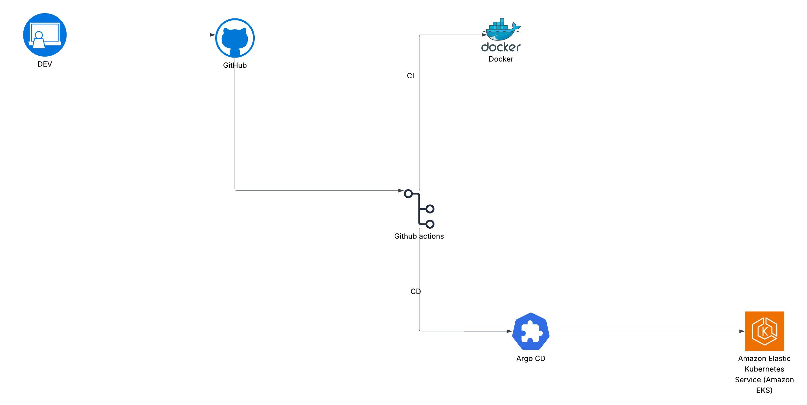

# 🚀 DevOps Full-Stack Project

This repository contains a **full DevOps pipeline** implementation for deploying a containerized full-stack application on **AWS EKS** using **Terraform, Docker, GitHub Actions, and ArgoCD**.

The goal of this project is to demonstrate **CI/CD automation, GitOps practices, and infrastructure as code (IaC)** for managing cloud-native applications.



### Flow:

1. **Developer (DEV)** pushes code to **GitHub**.
2. **GitHub Actions (CI/CD)** pipeline runs:

   * Builds and tests the code.
   * Builds and pushes Docker images to Docker Hub.
   * Applies infrastructure using Terraform.
   * Deploys manifests to GitHub (GitOps repo).
3. **ArgoCD** watches the GitOps repo and syncs changes to **Amazon EKS**.
4. **Application** becomes available on Kubernetes.

---

## 🛠️ Tools & Technologies

* **Version Control:** GitHub
* **CI/CD:** GitHub Actions
* **Containerization:** Docker
* **Orchestration:** Amazon Elastic Kubernetes Service (EKS)
* **Infrastructure as Code:** Terraform
* **GitOps:** ArgoCD
* **Secret Management:** AWS Secrets Manager
* **Monitoring:** Prometheus & Grafana

## ⚙️ Setup Instructions

### 1️⃣ Clone Repository

```bash
git clone https://github.com/<your-username>/<repo>.git
cd <repo>
```

### 2️⃣ Create EKS Cluster (AWS CLI)

Instead of Terraform, the EKS cluster is created with AWS CLI:

```bash
eksctl create cluster \
  --name <cluster-name> \
  --region <region> \
  --nodegroup-name standard-workers \
  --nodes-type <node-type>\
  -- nodes <> --nodes-min <> --nodes-max<>
```
Make sure OIDC is enabled for your cluster:
```bash
eksctl utils associate-iam-oidc-provider \
  --cluster kox-cluster \
  --region us-east-1 \
  --approve
```
Update your kubeconfig to connect kubectl to the new cluster:

```bash
aws eks update-kubeconfig --region <region> --name <cluster-name>
```
Create IAM Policy

This policy allows reading secrets from Secrets Manager:

```bash
aws iam create-policy \
  --policy-name <policy-name> \
  --policy-document '{
    "Version": "2012-10-17",
    "Statement": [
      {
        "Effect": "Allow",
        "Action": [
          "secretsmanager:GetSecretValue",
          "secretsmanager:DescribeSecret"
        ],
        "Resource": "*"
      }
    ]
  }'
```
Create IAM Role with Trust Policy
```bash
aws iam create-role \
  --role-name <role-name> \
  --assume-role-policy-document "{
    \"Version\": \"2012-10-17\",
    \"Statement\": [
      {
        \"Effect\": \"Allow\",
        \"Principal\": {
          \"Federated\": \"arn:aws:iam::<account-id>:oidc-provider/oidc.eks.<region>.amazonaws.com/id/<oidc-id>\"
        },
        \"Action\": \"sts:AssumeRoleWithWebIdentity\",
        \"Condition\": {
          \"StringEquals\": {
            \"oidc.eks.<region>.amazonaws.com/id/<oidc-id>:sub\": \"system:serviceaccount:external-secrets:service-account\"
          }
        }
      }
    ]
  }"
 ```
Attach Policy to Role
```bash
aws iam attach-role-policy \
  --policy-arn arn:aws:iam::<account-id>:policy/ExternalSecretsPolicy \
  --role-name <role-name>
```
Annotate Kubernetes Service Account
```bash
kubectl annotate serviceaccount service-account \
  -n external-secrets \
  eks.amazonaws.com/role-arn=arn:aws:iam::<account-id>:role/<role-name>
```
### 3️⃣ Provision Supporting Infra (Terraform)

Use Terraform for networking (VPC, subnets, gateways) or additional AWS services:

```bash
cd terraform
terraform init
terraform plan
terraform apply -auto-approve
```

### 4️⃣ Build & Push Docker Images

```bash
docker build -t <dockerhub-username>/app-frontend ./Application-Code/frontend
docker push <dockerhub-username>/app-frontend

docker build -t <dockerhub-username>/app-backend ./Application-Code/backend
docker push <dockerhub-username>/app-backend
```

### 5️⃣ Deploy Using Helm

Use Helm to install supporting services:

```bash
helm repo add argo https://argoproj.github.io/argo-helm
helm repo add prometheus-community https://prometheus-community.github.io/helm-charts
helm repo add external-secrets https://charts.external-secrets.io

helm install argocd argo/argo-cd -n gitops --create-namespace
helm install monitoring prometheus-community/kube-prometheus-stack -n monitoring
helm install external-secrets external-secrets/external-secrets -n external-secrets

#Create namespaces(gitops, my-app, external-secrets)
helm install <chart> <path>
```

### 6️⃣ GitHub Actions CI/CD

Pipeline automates:

* Build & test
* Docker push
* Helm deploys
* GitOps sync via ArgoCD

## ✅ Features

* Fully automated **CI/CD** pipeline.
* Infrastructure deployed via **Terraform**.
* Applications built & containerized with **Docker**.
* Kubernetes deployment with **ArgoCD (GitOps)**.
* Secure secrets via **AWS Secrets Manager**.
* Monitoring with **Prometheus & Grafana**.

## 📌 Future Improvements

* Add **Blue/Green or Canary Deployments** with Argo Rollouts.
* Integrate **service mesh (Istio or Linkerd)**.
* Expand monitoring dashboards with Grafana.
* Implement logging with ELK/EFK stack.

